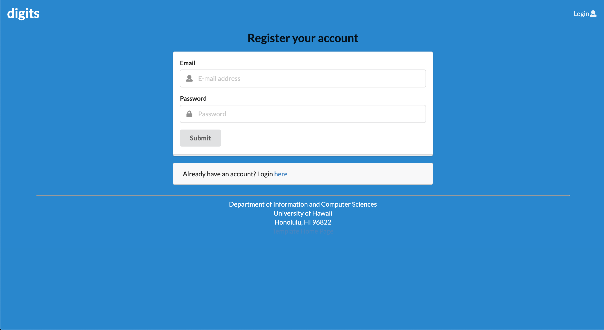
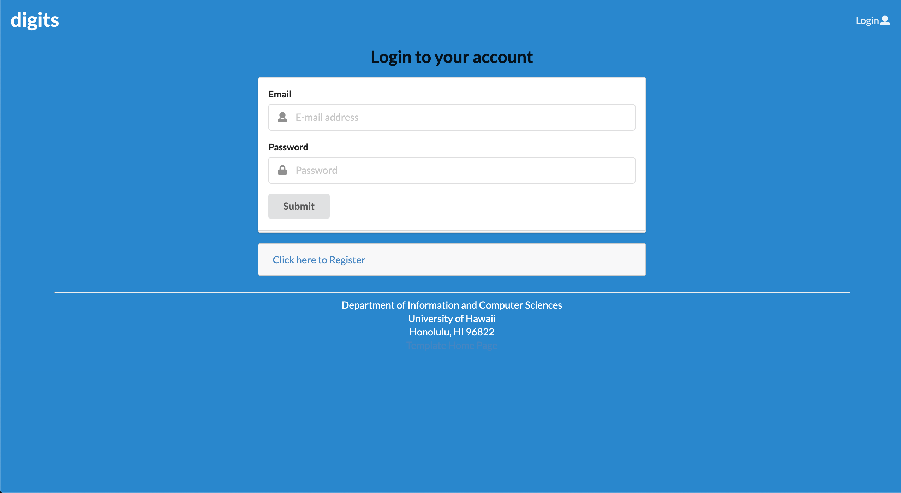
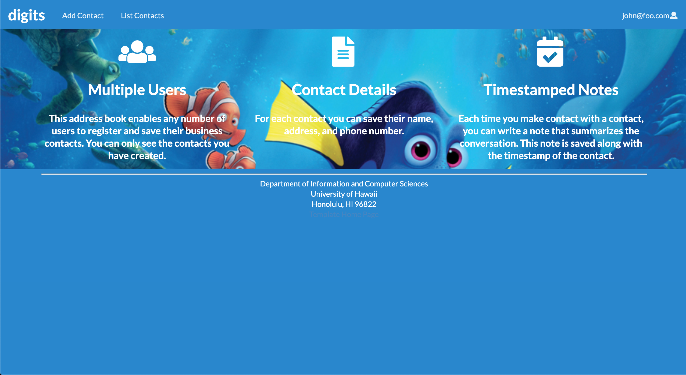
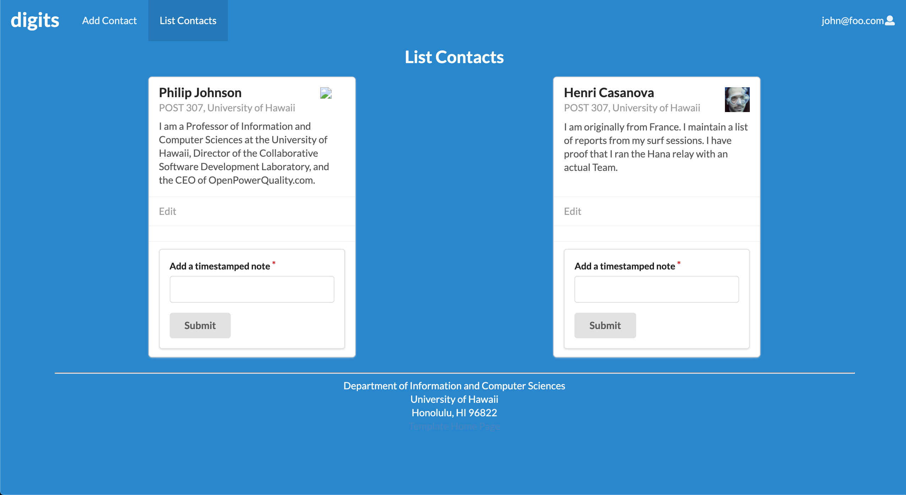
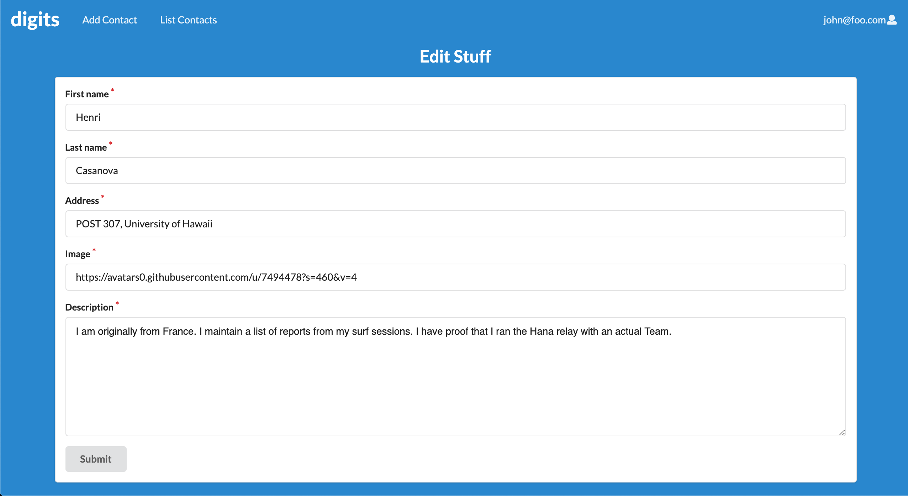

# digits application template 


Digits is an application that allows users to:
- register an account
- create and manage contacts
- add a set of timestamped notes

## Installation
First, install [Meteor](https://www.meteor.com/install).
 
Second, download a copy of [Digits](https://github.com/inwooCS/digits). Note that Digits is a private repo and so you will need to request permission from the author to gain access to the repo.

Third, cd into the app directory and install:
```
$ meteor npm install
```

You can run the application by invoking:
```
$ meteor npm run start
```

Important output you may experience:
```
meteor npm run start

> meteor-application-template-react@ start /Users/philipjohnson/github/philipmjohnson/digits/app
> meteor --no-release-check --settings ../config/settings.development.json

[[[[[ ~/github/philipmjohnson/digits/app ]]]]]

=> Started proxy.                             
=> Started MongoDB.                           
I20180305-18:06:02.764(-10)? Creating the default user(s)
I20180305-18:06:02.803(-10)?   Creating user admin@foo.com.
I20180305-18:06:02.803(-10)?   Creating user john@foo.com.
I20180305-18:06:02.804(-10)? Creating default contacts.
I20180305-18:06:02.804(-10)?   Adding: Johnson (john@foo.com)
I20180305-18:06:02.804(-10)?   Adding: Casanova (john@foo.com)
I20180305-18:06:02.804(-10)?   Adding: Binsted (admin@foo.com)
=> Started your app.

=> App running at: http://localhost:3000/
W20180305-18:06:02.805(-10)? (STDERR) Note: you are using a pure-JavaScript implementation of bcrypt.
W20180305-18:06:02.805(-10)? (STDERR) While this implementation will work correctly, it is known to be
W20180305-18:06:02.806(-10)? (STDERR) approximately three times slower than the native implementation.
W20180305-18:06:02.806(-10)? (STDERR) In order to use the native implementation instead, run
W20180305-18:06:02.806(-10)? (STDERR) 
W20180305-18:06:02.806(-10)? (STDERR)   meteor npm install --save bcrypt
W20180305-18:06:02.806(-10)? (STDERR) 
W20180305-18:06:02.806(-10)? (STDERR) in the root directory of your application.
```

# Walkthrough 
## Landing Page
The landing page introduces you to Digits.


## Register 
Click login and then Sign Up. 



## Sign In
Click login and then Sign in. 



###Home Page
After successfully logging in, the system brings you to the homepage. 



## List Contact
List Contact is a tab that shows your contacts.



## Edit
You can edit contacts as admin.


